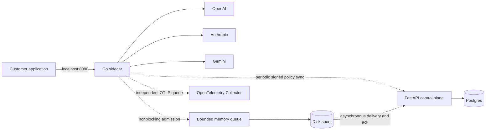

# Architecture

Each sidecar owns one tenant, one pinned public-key set, a private writable data directory, a local application credential and a separate control-plane `agent` credential. Provider credentials are available only to that sidecar. The shared task network namespace allows localhost access without an inbound gateway security-group rule.

Configuration fixes provider base URLs independently of signed policies. A policy can reorder only three known adapters and choose model identifiers. It cannot send credentials or prompts to a new host. HTTP redirects and implicit proxy environment variables are disabled for outbound gateway traffic.

Startup restores and authenticates the last policy. Expired policies retain their version high-water mark but cannot route requests. A background poll starts immediately, then repeats every 15 seconds with a five-second request deadline. Valid updates are fsynced and renamed before activation. Invalid updates leave the last verified policy untouched. The seven-day maximum policy lifetime bounds stale authorization; an outage continuing beyond policy expiry fails readiness and inference closed.

Inference admits a request through local authentication, readiness, rate limiting and a nonwaiting concurrency semaphore. Parsing and generation are bounded. Only explicit HTTP 429 and 503 responses allow another approved provider attempt, subject to the per-sidecar retry token bucket and attempt cap. There is no speculative parallel generation. HTTP 200 commits to that provider even before the first content byte. Transport uncertainty, malformed accepted responses and interrupted streams cannot fail over.

The circuit breaker opens after three transient failures for 15 seconds and admits one half-open probe. Circuit state and token buckets are process-local, not a distributed tenant quota. An exhausted circuit/retry budget returns a visible 503.

Telemetry admission does no disk or network work. A separate writer persists complete event files using private permissions, fsync, atomic rename and directory fsync. An uploader sends a bounded number per tick and deletes only after an exact event-ID acknowledgement. Postgres enforces unique `(tenant_id,id)` keys. A separate queue exports OTLP traces even when the control plane is unavailable. OTLP delivery is best effort; the product telemetry spool is independently acknowledged.

Spool limits: configurable bytes, 10,000 files, fixed admission queue. Saturation drops newest events and increments metrics. Kernel stalls can block a worker but cannot block inference admission. The memory-to-disk window is intentionally lossy under process crash. Standard Fargate ephemeral storage survives container restart within the same task, but not task replacement. Persistent volume deployment and its single-writer constraints are documented in deployment guidance.

SIGTERM turns readiness off and drains HTTP for up to 95 seconds. Remaining HTTP connections close; background delivery stops and the spool writer gets five seconds to drain. ECS `stopTimeout` is 120 seconds. App-to-sidecar dependencies cause the application to stop before the sidecar. A slow log sink is isolated with a bounded log queue; logs may be dropped.
